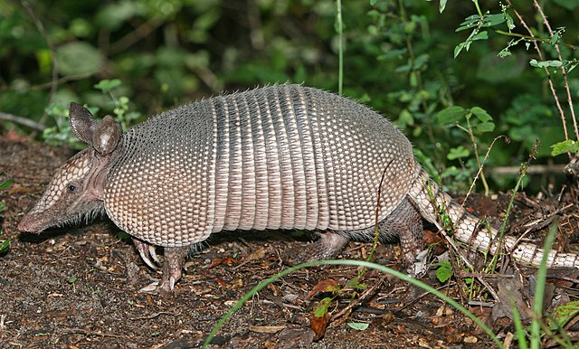

# Armadillo Loco
<b>Броненосцевые</b> (лат. Dasypodidae) — семейство млекопитающих отряда [броненосцев](https://ru.wikipedia.org/wiki/%D0%91%D1%80%D0%BE%D0%BD%D0%B5%D0%BD%D0%BE%D1%81%D1%86%D1%8B). Обитают в Центральной и Южной Америке. 

## Внешний вид
Панцирь составляют головной, плечевой и тазовый щиты и ряд обручевидных полос, опоясывающих тело сверху и с боков. Части панциря связаны между собой эластичной соединительной тканью, придающей подвижность всему панцирю. Поверх панциря лежат тонкие роговые пластинки квадратной или полигональной формы, образованные эпидермисом. Такие же щитки образуют броню на конечностях; хвост покрыт костяными кольцами. Живот и внутренние части лап у броненосца мягкие, незащищённые, покрытые жёсткими волосами. Волоски также растут между костными пластинками; иногда пронизывают и роговые чешуйки. Окраска панциря меняется от коричневой до розовой, волос — от серовато-коричневой до белой.

## Ареал
Броненосцы населяют степи, пустыни, саванны и опушки лесов Центральной и Южной Америки. Только девятипоясный броненосец Dasypus novemcinctus водится в центральных и юго-восточных штатах США, на севере проникая до Небраски.

## Образ жизни
Броненосцы ведут ночной образ жизни, днём прячась в норах. Большинство одиночны; реже встречаются пары и небольшие группы. Ведут наземный образ жизни; превосходно копают землю, роя себе норы и выкапывая пищу. Могут довольно быстро бегать; умеют плавать. При опасности спасаются бегством, прячась в кустарнике, или стремительно зарываются в землю. Только [трёхпоясные броненосцы](https://ru.wikipedia.org/wiki/%D0%A2%D1%80%D1%91%D1%85%D0%BF%D0%BE%D1%8F%D1%81%D0%BD%D1%8B%D0%B5_%D0%B1%D1%80%D0%BE%D0%BD%D0%B5%D0%BD%D0%BE%D1%81%D1%86%D1%8B) способны сворачиваться в шар, подобно ежу. Дыхательные пути у броненосцев объёмистые и служат резервуаром воздуха, так что эти животные могут задерживать дыхание в течение 6 минут. Это помогает им перебираться через водоёмы (часто броненосцы просто переходят их по дну). Набранный в лёгкие воздух компенсирует вес тяжёлого панциря, позволяя броненосцу плыть. 